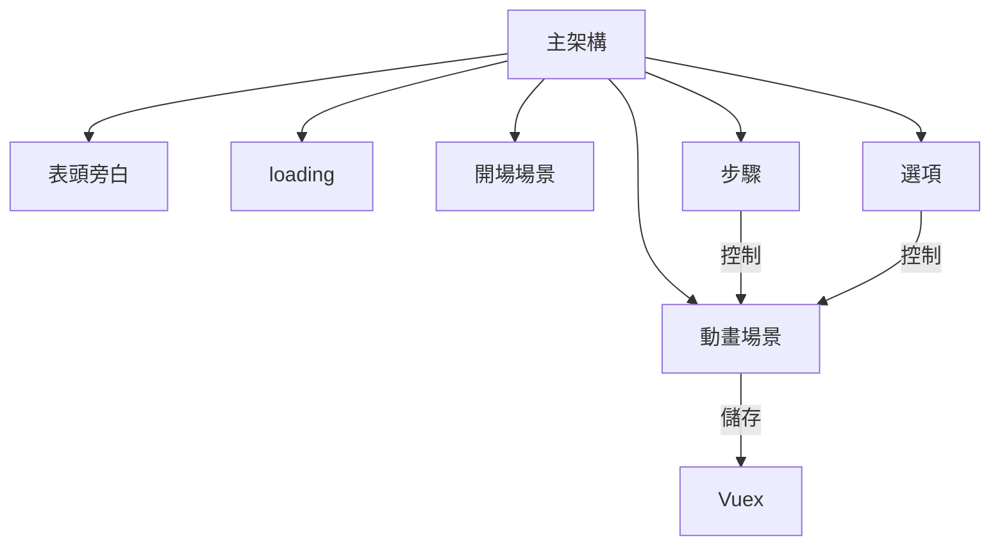

# 互動網頁

## 架構圖


## Project setup
```
npm install
```

### Compiles and hot-reloads for development
```
npm run serve
```

### Compiles and minifies for production
```
npm run build
```

### Lints and fixes files
```
npm run lint
```

### Customize configuration
See [Configuration Reference](https://cli.vuejs.org/config/).

### 部署 線上Demo
```
sh ./deploy.sh
```

### 線上Demo
[動畫Demo連結](https://arx827.github.io/vue_animate_movie/)、
[網頁串接Demo連結](https://arx827.github.io/marketing_platform/)
