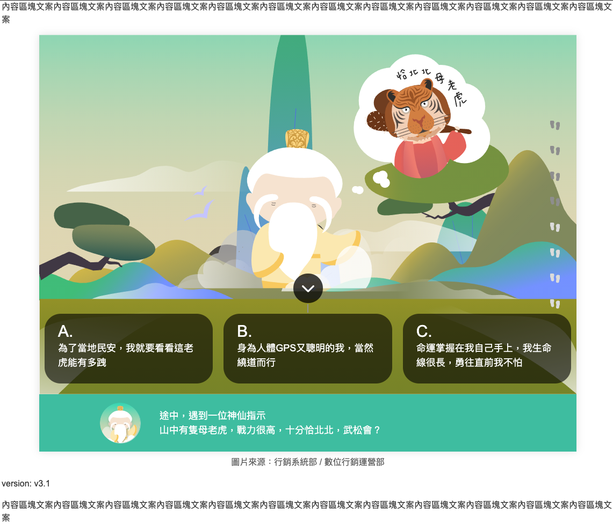
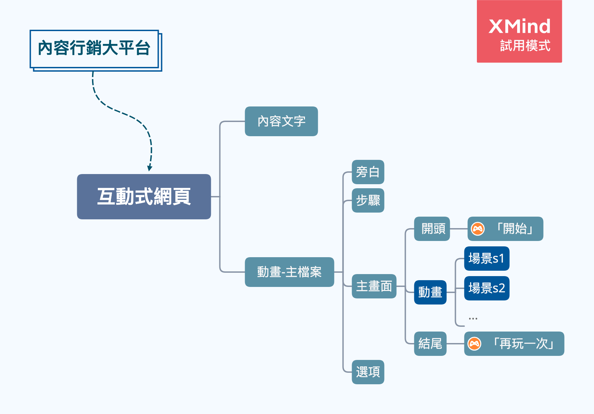
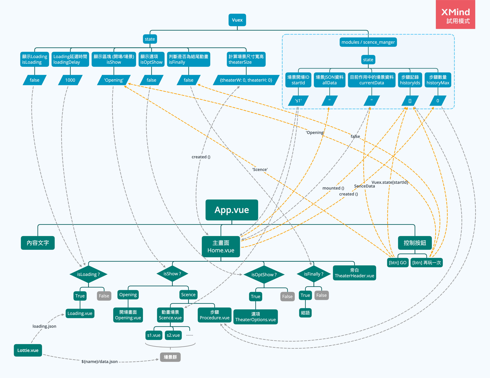

## 互動網頁
***
### 版面示意圖


***
### 網站架構圖


***
### 程式架構圖


***
### 流程說明
###### template顯示，皆使用transition淡出淡入
###### isShow切換時 [Opening、Scence]，<br>會在beforeCreate時開啟Loading，<br>mounted時關閉Loading
- 撈取json，取得 ***allData***
- ***初始化init***，設定 ***historyMax*** 歷史紀錄筆數(步驟數量)
- 清空步驟紀錄
- ***Opening***、***openingBtn*** 顯示
    - 點擊 ***openingBtn***
- ***Opening*** 隱藏
- ***Scence***、***TheaterOptions*** 顯示
    - 點擊 ***TheaterOptions*** 任一選項
- ***Scence*** 移除
- 動態切換場景id
- ***Scence***、***再玩一次*** 顯示 (切換場景後重新載入)
    - 若為結尾場景，等待動畫結束，顯示 ***conclusion結語***
    - ***再玩一次*** 按鈕顯示

#### 例外流程 - 轉場場景
- 遇到轉場場景，待動畫時間結束，自動跳轉至下一場景

#### 例外流程 - 點選步驟
- 點擊 ***Procedure步驟***
- ***Scence*** 移除
- 抓取History id
- 只保留前面的紀錄，後續紀錄清除<br>ex: 原始紀錄 [s1,s2,s3]， 點選第二筆後，歷史紀錄為 [s1,s2]
- ***Scence*** 顯示 (切換場景後重新載入)

***
### package.json套件
- **bootstrap**
- **popper.js**
- **jquery**
- **autoprefixer**
- **lodash**
- **vue-lottie** --- lottie動畫
- **vuex**

***
### 環境
- **serve** --- dev
- **build** --- production
- **github** --- 部署github預覽用
- **lint**

***
### 資料夾結構
```
src
├── assets
│   ├── helpers
│   │   ├── _mixins.scss
│   │   └── _var.scss
│   ├── icons
│   │   ├── loading
│   │   │   └── images
│   │   │       ├── img_0.svg
│   │   │       ├── img_1.svg
│   │   │       └── img_2.svg
│   │   ├── s1
│   │   │   └── images
│   │   │       ├── img_0.svg
│   │   │       ├── img_1.svg
│   │   │       └── img_2.svg
│   │   ├── ...
│   ├── images
│   │   ├── demo
│   │   │   ├── Icon_arrow_down.svg
│   │   │   ├── img_icon.png
│   │   │   ├── img_icon_tiger.png
│   │   │   └── img_testbg.jpg
│   │   ├── mk
│   │   │   ├── code.png
│   │   │   └── site.png
│   │   ├── Icon_material-refresh.svg
│   │   ├── img_god.svg
│   │   ├── img_icon_foot_off.svg
│   │   ├── img_icon_foot_on.svg
│   │   └── star_p1.svg
│   ├── scss
│   │   └── _reset.scss
│   ├── all.scss
│   └── logo.png
├── components
│   ├── Scences
│   │   ├── s1.vue
│   │   ├── s2.vue
│   │   ├── ...
│   │   └── template.vue
│   ├── Theater
│   │   ├── Procedure.vue
│   │   ├── TheaterHeader.vue
│   │   └── TheaterOptions.vue
│   ├── Loading.vue
│   ├── Lottie.vue
│   ├── Opening.vue
│   └── Scence.vue
├── lotties
│   ├── loading
│   │   └── loading.json
│   ├── s1
│   │   └── data.json
│   ├── s2
│   │   └── data.json
│   ├── ...
├── static
│   └── json
│       └── scenes.js
├── store
│   ├── scence_manger
│   │   ├── actions.js
│   │   ├── getter.js
│   │   ├── index.js
│   │   └── mutations.js
│   └── index.js
├── view
│   └── Home.vue
├── App.vue
├── main.js
└── package.json
```
***
### 場景資訊json
##### 檔案位置
```
src
├── static
│   └── json
│       └── scenes.js
```
##### 結構範例
```
{
    scenes: 's1',
    description: '有一天，武松要回家探望兄長，經過景陽崗之前看到一家酒館...',
    animationTime: 3000,
    questionOpt: [
      {
        optScenes: 's2',
        optQuestion: '進去喝酒',
      },
      {
        optScenes: 's3',
        optQuestion: '叫朋友來唱KTV',
      },
      {
        optScenes: 's4',
        optQuestion: '繼續趕路',
      },
    ],
  }
```
##### 結構說明
- **scenes** --- 場景id (須與檔案名稱相同)
- ***description*** --- 旁白
- ***animationTime*** --- 動畫預留時間(ex:時間過後才顯示選項)(毫秒)
- ***questionOpt*** --- 選項物件
    - ***optScenes*** --- 選項欲前往的場景id
    - ***optQuestion*** --- 選項顯示文字


***
### lottie 動畫檔案配置
#### 場景template
```
src/components/Scences/${name}.vue

src
├── components
│   ├── Scences
│   │   ├── s1.vue
```
#### 動畫json
```
src/lotties/${name}/data.json

src
├── lotties
│   ├── s1
│   │   └── data.json
```
#### 動畫json須引入的image
```
src/assets/icons/${name}/images/img_${i}.svg

src
├── assets
│   ├── icons
│   │   ├── s1
│   │   │   └── images
│   │   │       ├── img_0.svg
│   │   │       ├── img_1.svg
│   │   │       └── img_2.svg
```


***
### 部署 線上Demo
```
sh deploy.sh
```

### 線上Demo
[動畫Demo連結](https://arx827.github.io/vue_animate_movie/)、
[網頁串接Demo連結](https://arx827.github.io/marketing_platform/)
